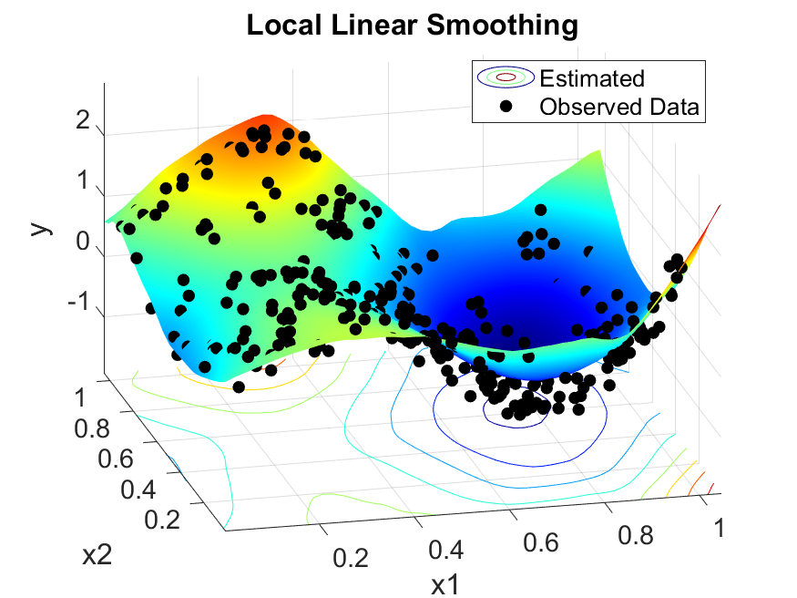

# Getting Started with SpatCorrNPR
Please download the source codes from the Journal of Statistical Software archieve.

Alternatively, please clone this following GitHub reporsitory and add it to your MATLAB path:
```matlab
git clone https://github.com/Mehnuma/SpatCorrNPR.git
addpath(genpath('SpatCorrNPR'))
```

# For Direct MATLAB Installation of the SpatCorrNPR GUI
Please follow the instructions below to install `SpatCorrNPR` from a MATLAB app installer file.
+ Locate and download the GUI installer file: `SpatCorrNPR.mlappinstall`. 
+ From the MATLAB window, the user can click on `APPS` > `Install App` > `SpatCorrNPR.mlappinstall`.
+ A prompt will ask the user whether they would like to install the app. 
+ If the user clicks on `Install`, the app will be installed and can be found on the APPS tab as `SpatCorrNPR`.

# For Direct MATLAB Installation of the SpatCorrNPR Command Line Toolbox
Please follow the instructions below to install `SpatCorrNPR` from a MATLAB toolbox installer file.
+ Locate and download the toolbox installer file: `SpatCorrNPRToolbox.mltbx`.
+ By double-clicking this file, a prompt will appear, and the toolbox will be installed by selecting `Install`.
+ The toolbox can be managed by clicking `Add-Ons` > `Manage Add-Ons`.

# Octave Usage
To use the `BLeS` toolbox in Octave, please download and add the [Octave Folder](https://github.com/Mehnuma/SpatCorrNPR/tree/main/src/Octave) to the Octave working directory on your local machine. 

# Test Example Run
Please run the `test_SpatCorrNPR.m' file to check the proper installation. If everything is okay, you should see the following plot generated.


# First Use Instructions
Here are some basic instructions to complete onboaring.
+ Please make sure you inputs are 1-D or 2-D. Anything beyond that is not supported by the toolbox currently.
+ For bandwidth optimization with 1-D data, please ensure that the limits are scalar, whereas for a 2-D optimization, the bandwidth limits are 2-by-2 symmetric matrices.
+ To plot a smoothed function using 1-D data, please supply a scalar bandwidth, and use a 2-by-2 symmetric bandwidth matrix for 2-D data.
+ To optimize using the GCVc criterion, you need to provide the true correlation matrix.
+ A bandwidth is required for evaluation, unless there is one available on the workspace from the `Bandwidth Optimization` module.
+ To use the ASE error evaluation criterion, the true function information is required.